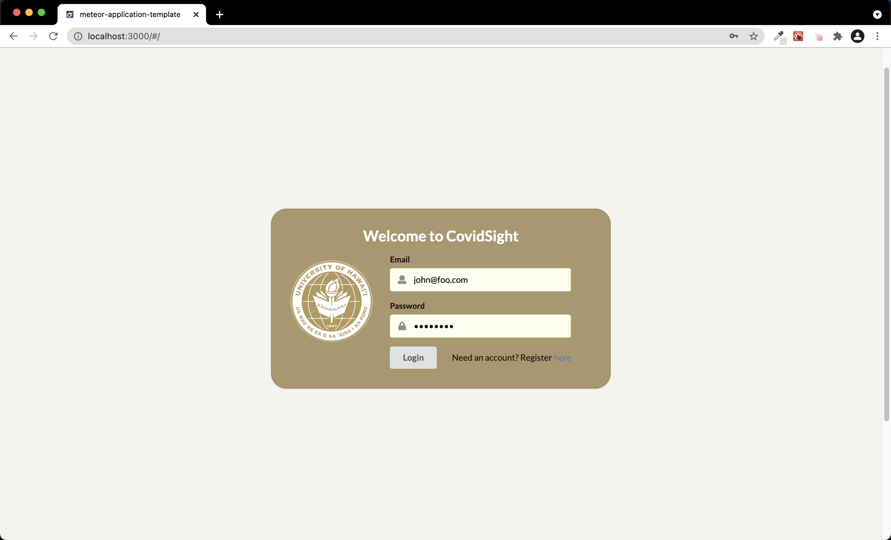

## Table of contents

* [Overview](#overview)
* [Goal](#goal)
* [User Guide](#user-guide)
* [Developer Guide](#developer-guide)
* [Development History](#development-history)
* [Contact Us](#contact-us)


## Overview
Welcome to Covidsight! The goal of this project is to create an application that will be used as a "warm up" for two HACC events that our group will be participating in. This application is to be build as a requirement for ICS 496 as the University of Hawaii at Manoa. This application is to act as a COVID-19 tracking application, similar to the University of Hawaii's COVID-19 tracking application _**[Lumisight](https://www.hawaii.edu/its/covid-19-resources/about-lumisight-uh/)**_.

## Goal
As stated above, our goal is to create a COVID-19 tracking application that mimics the functionality of _**Lumisight**_. This application will allow logged in users to log if they are experiencing COVID-19 symptoms or not. This will be done by having the user answer a quick survey asking if they have any of the COVID-19 symptoms listed. The user will then have the ability to click "yes" or "no". Upon submission of the user answer, the user answer will be stored and displayed on another page of the application with the data of the submission, acting as a record for the user. This status can be changed at any part of the day if the user chooses to resubmit their answer. The application will also allow the user to upload information about their vaccination status by having them upload an image of their vaccine card if necessary.

## User Guide
Our application is currently in its early stages of development..
Below are screenshot of the pages that we have implemented into our application so far.  

### Login and Registering
When the user first arrives to the application, they will be asked to sign-in if they are a current user. If they are not a current user, they have the option to register using the "register" link at the bottom right of the container. This will take the user to the register page where they create an account with the application. 




## Developer Guide
If you wish to install the _**CovidSight**_ application locally, you can follow the directions below. 

First, [install Meteor](https://www.meteor.com/install).

Second, download a copy of [CovidSight](https://github.com/Covid-Sight/covid-sight).

Third, open up your terminal/command prompt and cd into the app directory of the Minerva Medical copy you had just downloaded
and install the necessary libraries by invoking meteor npm install:

```
$ meteor npm install
```

After meteor is installed, you can run the application by typing in the command:

```
$ meteor npm run start
```


The first time you run the app, it will create some default users that have been added to the database. Here is an
example of how the output may look:

```
I20201119-23:01:44.024(-10)? Creating the default user(s)
I20201119-23:01:44.024(-10)?   Creating user admin@foo.com.
I20201119-23:01:44.332(-10)?   Creating user john@foo.com.
I20201119-23:01:44.754(-10)? Monti APM: completed instrumenting the app
=> Started your app.
```

Note regarding bcrypt warning: You may also get a similar message when running this application:

```
=> Started proxy.                             
=> Started MongoDB.                           
W20201119-22:58:19.472(-10)? (STDERR) Note: you are using a pure-JavaScript implementation of bcrypt.
W20201119-22:58:19.515(-10)? (STDERR) While this implementation will work correctly, it is known to be
W20201119-22:58:19.516(-10)? (STDERR) approximately three times slower than the native implementation.
W20201119-22:58:19.516(-10)? (STDERR) In order to use the native implementation instead, run
W20201119-22:58:19.516(-10)? (STDERR) 
W20201119-22:58:19.516(-10)? (STDERR)   meteor npm install --save bcrypt
W20201119-22:58:19.516(-10)? (STDERR) 
W20201119-22:58:19.517(-10)? (STDERR) in the root directory of your application.
I20201119-22:58:20.471(-10)? Monti APM: completed instrumenting the app
=> Started your app.
```

On some operating systems (particularly Windows), installing bcrypt is much more difficult than implied by the above
message. Bcrypt is only used in Meteor for password checking, so the performance implications are negligible until your
site has very high traffic. You can safely ignore this warning without any problems during initial stages of
development.

If all goes well, the template application will appear at http://localhost:3000. You can login in using the credentials
in setting.development.json, or else you can register an new account.

Lastly, you can run ESLint over the code in the imports/directory with:

```
$ meteor npm run lint
```


## Development History
### Milestone 1 
In progress..

## Contact Us
If you would like to contact the creators of _**CovidSight**_ you can email us at:

[Kyra Ikeda](https://kyraikeda.github.io/) - kyrai@hawaii.edu
[Eric Lam](https://airyclam.github.io/) - lameric@hawaii.edu
[Glen Larita](https://glarita.github.io/) - glarita@hawaii.edu
[Chase Lee](https://chase-lee-ui.github.io/) - leechase@hawaii.edu
[Irene Ma](https://irene-ma.github.io/) - mairene@hawaii.edu


