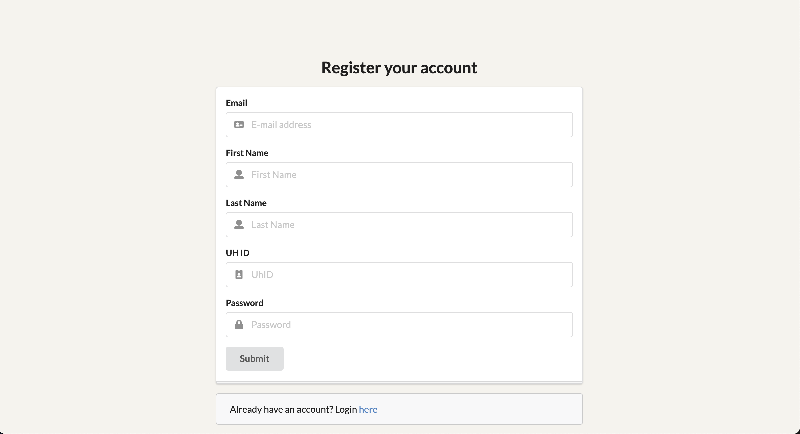
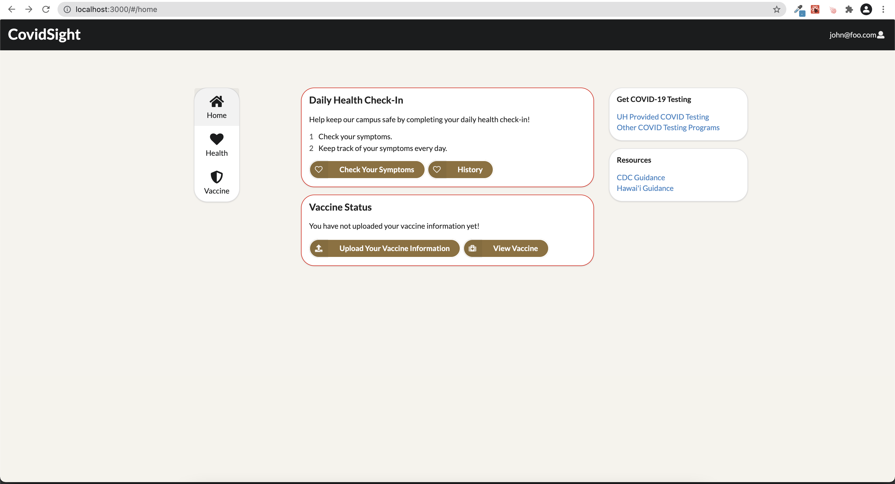
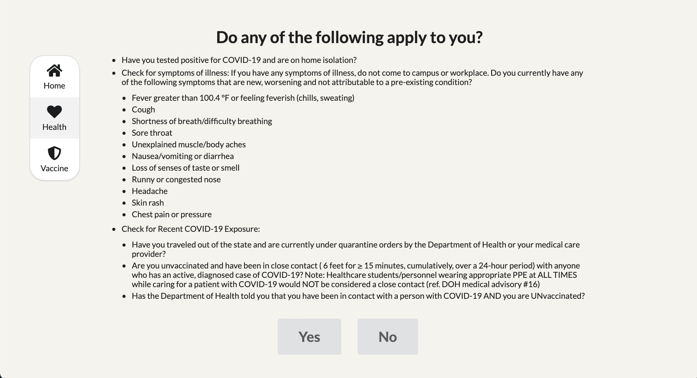
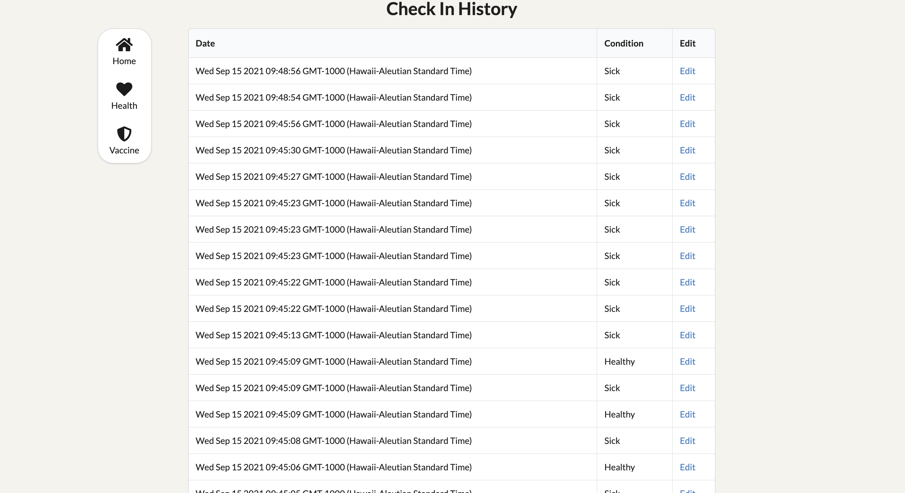
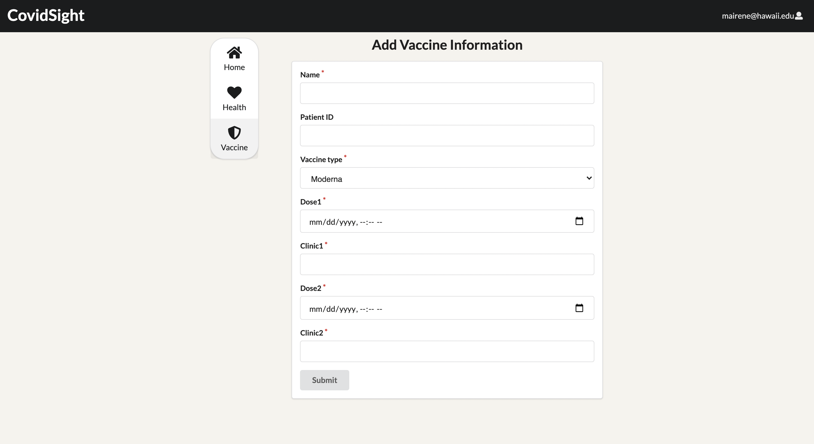
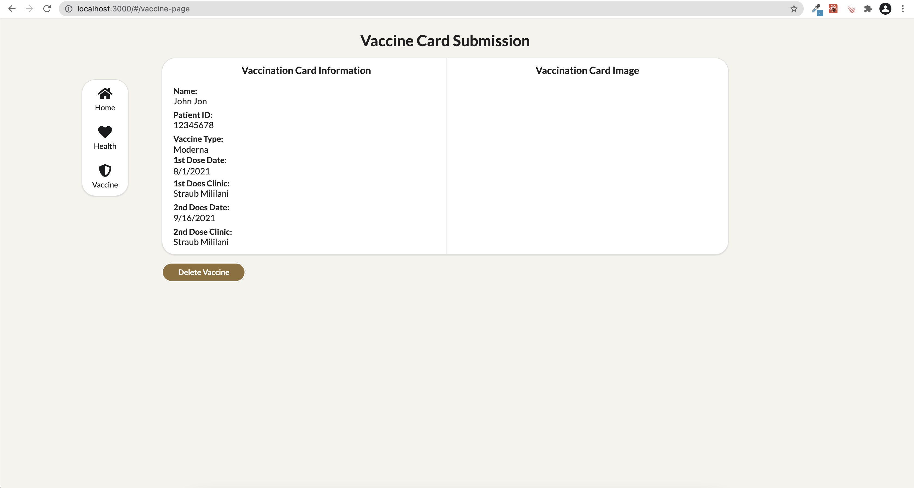
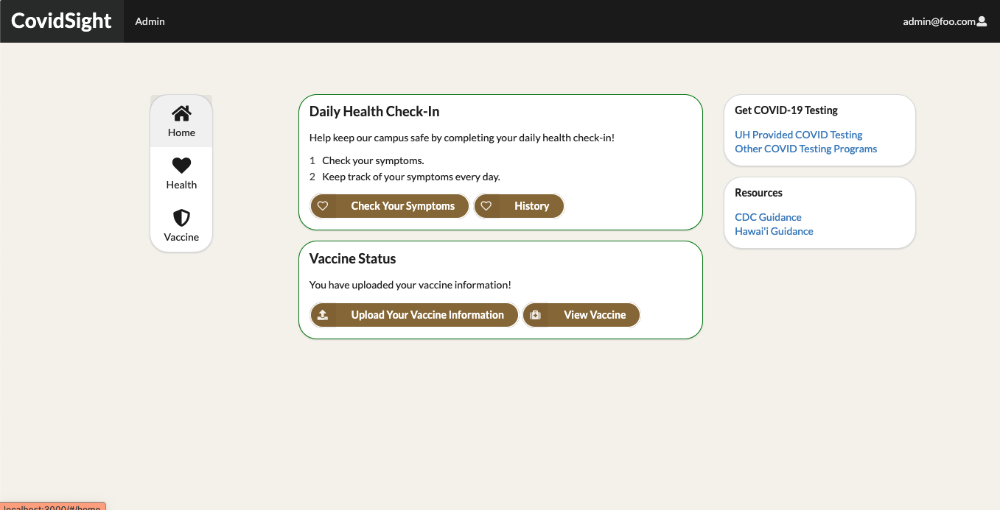

## Table of contents

* [Overview](#overview)
* [Goal](#goal)
* [User Guide](#user-guide)
* [Developer Guide](#developer-guide)
* [Development History](#development-history)
* [Contact Us](#contact-us)


## Overview
Welcome to CovidSight! The goal of this project is to create an application that will be used as a "warm up" for two hackathons that our group will be participating in. This application functions as a COVID-19 tracking application, similar to the University of Hawaii's COVID-19 tracking application _**[Lumisight](https://www.hawaii.edu/its/covid-19-resources/about-lumisight-uh/)**_. This application is created as a requirement for ICS 491 at the University of Hawaii at Manoa. 

## Goal
As stated above, our goal is to create a COVID-19 tracking application that mimics the functionality of _**Lumisight**_. This application will allow logged in users to log whether they are experiencing COVID-19 symptoms or not. This will be done by having the user answer a quick survey asking if they have any of the COVID-19 symptoms listed. The user will then have the ability to click "yes" or "no". Upon submission of the user answer, the user answer will be stored and displayed on another page of the application with the data of the submission, acting as a record for the user. This status can be changed at any part of the day if the user chooses to resubmit their answer. The application will also allow the user to upload information about their vaccination status by having them upload an image of their vaccine card.

## User Guide
Our application is currently in its early stages of development. It is currently deployed _**[here](https://covid-sight.meteorapp.com/)**_.
Below are screenshots of the pages that we have implemented into our application so far.  

### Login and Registering
When the user first arrives to the application, they will be asked to sign-in if they are a current user. If they are not a current user, they have the option to register using the "register" link at the bottom right of the container. This will take the user to the register page where they can create an account with the application. 




### Home Page
Upon successfully logging in or signing up, the user will be redirected to the homepage where there is a health check-in and a vaccine upload section. These sections are outlined in red if the user needs to fill out information for that section or green if the user completed that section. The user is able to check-in their health on a daily basis and also have an option to enter their vaccine information. On the side there are additional resources available relating to COVID-19.



### Health Check-in 
If you click on either the Health icon on the side nav bar or the "Check Your Symptoms" button in the Daily Health Check-in box, it will take you to a page where you answer "yes" or "no" to the following question. 



### Check-in History
Upon answering "yes" or "no" to the health check-in prompt, your response will be recorded in this page where it lists down all of your previous check-ins. You can also edit your response by clicking on the edit button where it will navigate you to the same prompt to answer "yes" or "no" and will update your response. You can also naviage to this history page by clicking on the "History" button in the Health Check-in box on the homepage.



### Vaccine
If you have been vaccinated and want to upload your vaccine information, you can click on "Vaccine" on the side nav bar or "Upload Your Vaccine Information" in the vaccine box on the homepage. The user will be taken to the vaccine upload page where they will enter the following information. As of now, uploaded vaccine status does not update on homepage, but will be implemented in milestone 2.



### View Vaccine
If you click the "View Vaccine" button on the home page, it redirects you to the vaccine-page, this is where all of your inputted information for vaccine is put. There will also be a vaccination card image accompanied with it on the right column. You can also delete the current vaccine information inputted.



### Homepage - Cleared for COVID
Once a daily check up has been made through the health check and a vaccine card has been submitted through the Vaccine page, the border of the home page widgets will turn green instead of red. This allows the user to easily see that they have successfully checked in and submitted their vaccine information to the application.



## Developer Guide
If you wish to install the _**CovidSight**_ application locally, you can follow the directions below. 

First, [install Meteor](https://www.meteor.com/install).

Second, download a copy of [CovidSight](https://github.com/Covid-Sight/covid-sight).

Third, open up your terminal/command prompt and cd into the app directory of the Minerva Medical copy you had just downloaded
and install the necessary libraries by invoking meteor npm install:

```
$ meteor npm install
```

After meteor is installed, you can run the application by typing in the command:

```
$ meteor npm run start
```


The first time you run the app, it will create some default users that have been added to the database. Here is an
example of how the output may look:

```
I20201119-23:01:44.024(-10)? Creating the default user(s)
I20201119-23:01:44.024(-10)?   Creating user admin@foo.com.
I20201119-23:01:44.332(-10)?   Creating user john@foo.com.
I20201119-23:01:44.754(-10)? Monti APM: completed instrumenting the app
=> Started your app.
```

Note regarding bcrypt warning: You may also get a similar message when running this application:

```
=> Started proxy.                             
=> Started MongoDB.                           
W20201119-22:58:19.472(-10)? (STDERR) Note: you are using a pure-JavaScript implementation of bcrypt.
W20201119-22:58:19.515(-10)? (STDERR) While this implementation will work correctly, it is known to be
W20201119-22:58:19.516(-10)? (STDERR) approximately three times slower than the native implementation.
W20201119-22:58:19.516(-10)? (STDERR) In order to use the native implementation instead, run
W20201119-22:58:19.516(-10)? (STDERR) 
W20201119-22:58:19.516(-10)? (STDERR)   meteor npm install --save bcrypt
W20201119-22:58:19.516(-10)? (STDERR) 
W20201119-22:58:19.517(-10)? (STDERR) in the root directory of your application.
I20201119-22:58:20.471(-10)? Monti APM: completed instrumenting the app
=> Started your app.
```

On some operating systems (particularly Windows), installing bcrypt is much more difficult than implied by the above
message. Bcrypt is only used in Meteor for password checking, so the performance implications are negligible until your
site has very high traffic. You can safely ignore this warning without any problems during initial stages of
development.

If all goes well, the template application will appear at http://localhost:3000. You can login in using the credentials
in setting.development.json, or else you can register an new account.

Lastly, you can run ESLint over the code in the imports/directory with:

```
$ meteor npm run lint
```


## Development History
### Milestone 1 
Homepage landing & Side Nav Bar implementation - Kyra Ikeda <br />
Vaccine Page Implementation - Eric Lam <br />
Configuring tests & Implement log in page - Glen Larita <br />
Check in Page Implementation - Chase Lee <br />
Register Page Implementation and deploy - Irene Ma

## Contact Us
If you would like to contact the creators of _**CovidSight**_ you can email us at:

[Kyra Ikeda](https://kyraikeda.github.io/) - kyrai@hawaii.edu\
[Eric Lam](https://airyclam.github.io/) - lameric@hawaii.edu\
[Glen Larita](https://glarita.github.io/) - glarita@hawaii.edu\
[Chase Lee](https://chase-lee-ui.github.io/) - leechase@hawaii.edu\
[Irene Ma](https://irene-ma.github.io/) - mairene@hawaii.edu


